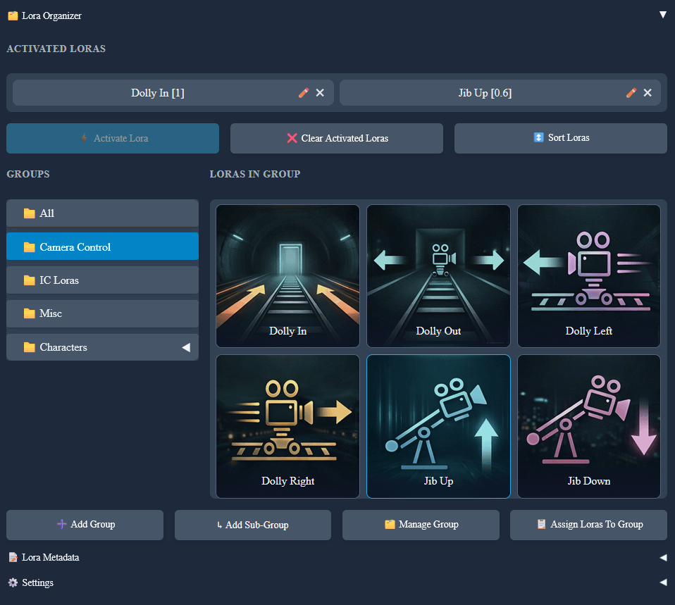

# Lora Organizer

Lora Organizer is a plugin for [Wan2GP](https://github.com/deepbeepmeep/Wan2GP).

It adds a UI that lets you organize loras into groups and subgroups, store metadata, and activate loras with their trigger words and strength in one click.

## Features

- Create, rename, delete, and reorder groups.
- Create nested subgroups.
- Reorder loras with drag and drop.
- Sort loras by name or by most used.
- Change the display name of a lora so long filenames can be shown with shorter, cleaner names without changing the original file.
- Store per-lora metadata:
  - trigger words
  - default strength
  - notes
  - URL
  - preview images
- Activate a lora with one click using its saved default strength, and apply its trigger words based on the selected trigger-word behavior.
- Choose how trigger words are applied:
  - add to the beginning of the prompt
  - add to the end of the prompt
  - replace the prompt with trigger words from all activated loras
  - do not add trigger words
- Automatically detect Wan 2.2 high/low loras and assign `1;0` as the default strength for high loras and `0;1` for low loras.
- Activate matched Wan 2.2 high/low lora pairs with one click when available.
- Clear all activated loras and restore them if needed.
- Optionally remove trigger words from the prompt when deactivating loras.
- Display loras in:
  - vertical list view
  - horizontal list view
  - thumbnail view
- Use preview images as lora thumbnails in thumbnail view.
- Cycle thumbnail preview images when hovering, auto-cycle them, or keep them static.
- Activated-loras control that shows activated loras and strengths in one place and allows to edit strengths inline, deactivate or reorder activated loras.
- Place Lora Organizer:
  - in the lora tab
  - below the prompt in the main tab
  - in its own tab

## Installation

1. Open the `Plugins` tab in Wan2GP.
2. In the `Discover & Install` section on the right side, find `Lora Organizer`.
3. Click `Install`.
4. Restart Wan2GP if needed.

## How It Works

The plugin can be shown:

- in the lora tab
- below the prompt in the main tab
- in its own tab

Inside it you can:

- browse groups and subgroups
- browse loras in the selected group
- manage group structure
- manage lora metadata
- activate loras directly from the organizer
- manage activated loras from the custom activated-loras list

## Metadata

Each lora can store:

- Display Name
- Trigger Words
- Default Strength
- Info / Notes
- Lora URL
- Preview Images

Metadata fields are editable. When you change a field, `Save Changes` and `Cancel` appear.

Preview images are stored in the plugin data folder under `data/images/<model>/...`.
The first preview image is used as the lora thumbnail in thumbnail view.

## Data Storage

The plugin stores its data in JSON files in the plugin folder for the active lora folder/model context.

This includes:

- groups and subgroups
- group order
- lora order
- metadata
- preview image order
- usage counts
- plugin settings

The lora files themselves are not modified.

## Status

Current plugin version: `1.13`
