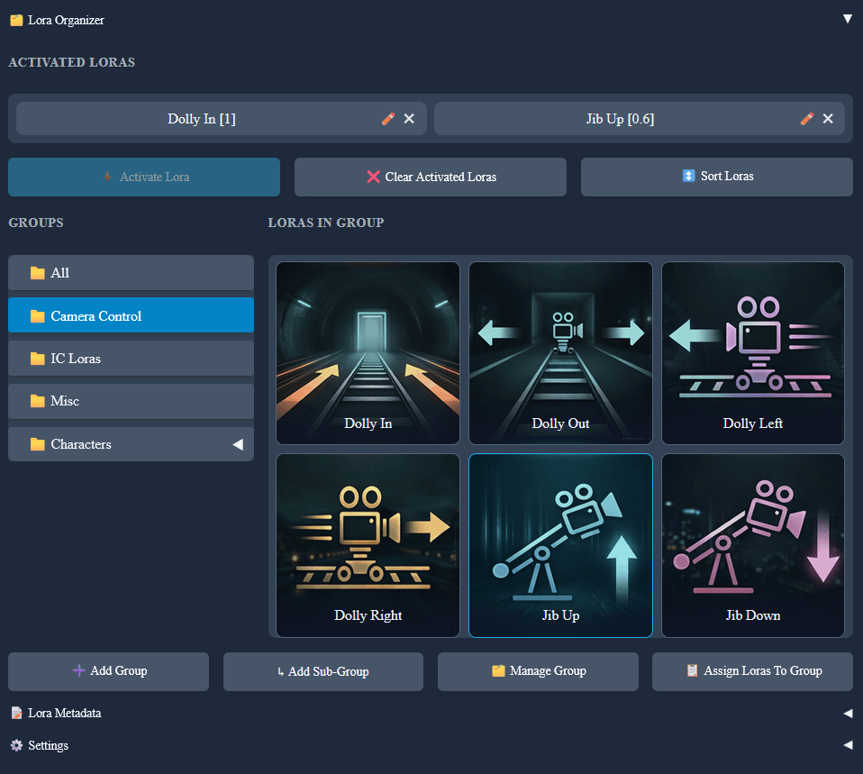

# LoRA Organizer

LoRA Organizer is a plugin for [Wan2GP](https://github.com/deepbeepmeep/Wan2GP).

It adds a UI that lets you organize LoRAs into groups and subgroups, store metadata, and activate LoRAs with their trigger words and strength in one click.

## Features

- Create, rename, delete, and reorder groups.
- Create nested subgroups.
- Reorder LoRAs with drag and drop.
- Sort LoRAs by name or by most used.
- Change the display name of a LoRA so long filenames can be shown with shorter, cleaner names without changing the original file.
- Store per-LoRA metadata:
  - trigger words
  - default strength
  - notes
  - URL
  - preview images
- Activate a LoRA with one click using its saved default strength, and apply its trigger words based on the selected trigger-word behavior.
- Choose how trigger words are applied:
  - add to the beginning of the prompt
  - add to the end of the prompt
  - replace the prompt with trigger words from all activated LoRAs
  - do not add trigger words
- Automatically detect Wan 2.2 high/low LoRAs and assign `1;0` as the default strength for high LoRAs and `0;1` for low LoRAs.
- Activate matched Wan 2.2 high/low LoRA pairs with one click when available.
- Clear all activated LoRAs and restore them if needed.
- Optionally remove trigger words from the prompt when deactivating LoRAs.
- Display LoRAs in:
  - vertical list view
  - horizontal list view
  - thumbnail view
- Use preview images as LoRA thumbnails in thumbnail view.
- Cycle thumbnail preview images when hovering, auto-cycle them, or keep them static.
- Activated-LoRAs control that shows activated LoRAs and strengths in one place and allows to edit strengths inline, deactivate or reorder activated LoRAs.
- Place LoRA Organizer:
  - in the LoRA tab
  - below the prompt in the main tab
  - in its own tab

## Installation

1. Open the `Plugins` tab in Wan2GP.
2. In the `Discover & Install` section on the right side, find `LoRA Organizer`.
3. Click `Install`.
4. Restart Wan2GP if needed.

## How It Works

The plugin can be shown:

- in the LoRA tab
- below the prompt in the main tab
- in its own tab

Inside it you can:

- browse groups and subgroups
- browse LoRAs in the selected group
- manage group structure
- manage LoRA metadata
- activate LoRAs directly from the organizer
- manage activated LoRAs from the custom activated-LoRAs list

## Metadata

Each LoRA can store:

- Display Name
- Trigger Words
- Default Strength
- Info / Notes
- LoRA Source URL
- Preview Images

Metadata fields are editable. When you change a field, `Save Changes` and `Cancel` appear.

Preview images are stored in the plugin data folder under `data/images/<model>/...`.
The first preview image is used as the LoRA thumbnail in thumbnail view.

## Data Storage

The plugin stores its data in JSON files in the plugin folder for the active LoRA folder/model context.

This includes:

- groups and subgroups
- group order
- LoRA order
- metadata
- preview image order
- usage counts
- plugin settings

The LoRA files themselves are not modified.

## Status

Current plugin version: `1.20`
